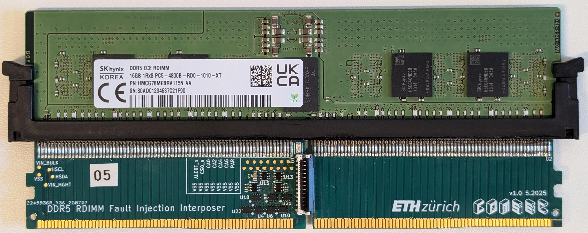
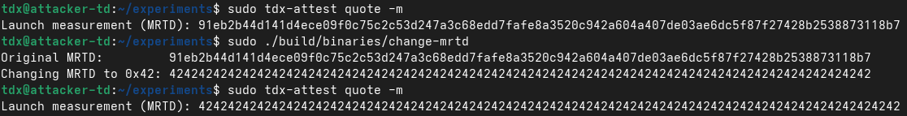
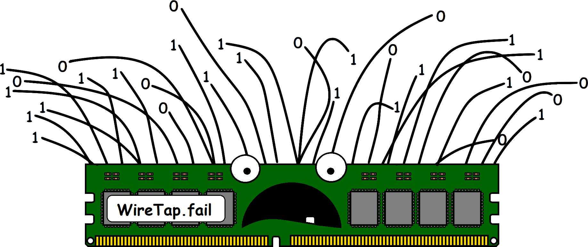

<em>
DDRop is a small, low-cost hardware interposer device that can make writes to a server's memory disappear, causing the computer to read old data as if it were newly written.
This trick has serious consequences for confidential computing technologies designed to protect sensitive workloads on shared cloud infrastructure.
DDRop can interfere with protected virtual machines on Intel and AMD platforms and, on Intel TDX, even forge the security evidence used to prove that a virtual machine is trusted.
</em>

#### The missing guarantee: freshness

  

    <i class="fas fa-history section-ico" aria-hidden="true"></i>
  

  

    To handle large cloud workloads, the memory encryption in <a href="https://www.intel.com/content/www/us/en/developer/tools/trust-domain-extensions/overview.html">Intel <abbr title="Trust Domain Extensions">TDX</abbr></a>, <a href="https://www.intel.com/content/www/us/en/products/docs/accelerator-engines/software-guard-extensions.html">Intel Scalable <abbr title="Software Guard Extensions">SGX</abbr></a>, and <a href="https://www.amd.com/en/developer/sev.html">AMD <abbr title="Secure Encrypted Virtualization — Secure Nested Paging">SEV-SNP</abbr></a> keeps data confidential, but does not provide freshness.
    Without it, the processor can confirm that memory is <em>encrypted</em>; it cannot confirm that memory is <em>current</em>. Stale data still decrypts perfectly.
  

  
<i class="fas fa-lightbulb me-1"></i> Why does a dropped write matter?

  Think of encrypted memory as a locked notebook with no page numbers or dates.
  If an attacker stops a new line from being written, the old line remains. When you read it later, it still decrypts to valid text.
  The system has no way to tell that the latest update never arrived.
  DDRop uses this gap by silently discarding writes. A protected VM can then continue using old, attacker-chosen contents, while the encryption engine sees nothing wrong.

DDRop interferes with writes rather than trying to read encrypted data, so memory encryption does not stop the attack. It also uses interfaces that the hypervisor relies on to move protected memory, so the victim VM does not need to contain a software bug. On Intel TDX, we use the attack to put a confidential VM into debug mode and forge attestation reports.

#### A silent switch on the DDR5 bus

Earlier DDR5 interposers were passive and required bulky equipment. They also had to slow the memory bus to work with second-hand lab hardware, making the change easier to notice. DDRop is a compact board of analog switches that runs at native DDR5 speed and can be installed in minutes.

DDR5's redesigned command bus makes the address-aliasing tricks used by earlier attacks impractical. DDRop instead interferes with the bus's error handling. The interposer deliberately introduces a parity error and then suppresses the alert. The memory module discards the command, and the processor does not learn that the command was dropped. The write is *gone*.

All schematics, board files, and firmware are released as open source on our [<i class="fab fa-github"></i> GitHub repository](https://github.com/ddropattack/ddrop).

<a class="link-label" data-bs-toggle="collapse" href="#bom" role="button" aria-expanded="false" aria-controls="bom"><i class="fas fa-info-circle"></i> What does it cost to build? <i class="fas fa-chevron-down" aria-hidden="true"></i></a>

<table class="table table-hover mx-auto w-100" style="margin: 0px auto; display: table;">
  <thead>
    <tr><th>Component</th><th>Supplier</th><th>Cost</th></tr>
  </thead>
  <tbody>
    <tr><td>Interposer PCB with stencil</td><td>JLCPCB</td><td>$45</td></tr>
    <tr><td>Interposer electronic parts</td><td>Digikey, LOTES</td><td>$30</td></tr>
    <tr><td>Controller board PCB</td><td>JLCPCB</td><td>$4</td></tr>
    <tr><td>Controller electronic parts</td><td>Digikey</td><td>$40</td></tr>
    <tr><td>Teensy 4.1 microcontroller</td><td>Digikey</td><td>$40</td></tr>
    <tr><td>Total</td><td></td><td>$159</td></tr>
  </tbody>
</table>

Bill of materials for a single interposer system (at a build quantity of 10). Excludes R&amp;D and assembly labor.

#### DDRop in action: Breaking Intel TDX
{: #ddrop-in-action}

Intel TDX isolates confidential virtual machines, called Trust Domains (TDs), from a potentially compromised host hypervisor. To prevent the privileged hypervisor from tampering with guest memory translations, TDX delegates address mappings to Secure Extended Page Tables (SEPT), which are encrypted in RAM under the respective TD's key and managed exclusively by trusted firmware (the TDX module).

When the host allocates a new SEPT page (`TDH.MEM.SEPT.ADD`), the TDX module writes empty entries to securely initialize it. DDRop silently drops these writes, so the page keeps pre-crafted stale ciphertext that decrypts into malicious page-table entries. This primitive is 100% deterministic and lets an attacker-controlled TD remap its own memory onto *any physical address* in RAM. 
Under TDX's default logical integrity (LI) mode, this allows the attacker to corrupt the ciphertext of *other* TDs and their control structures. Even TDX's stronger cryptographic integrity (CI) mode would only prevent tampering across different key domains, still allowing an attacker to forge the attestation measurement of their own TD.

  
<i class="fas fa-unlock me-1"></i> From dropped writes to arbitrary memory access

  Controlling the secure page tables allows an adversary to read from and write to any physical address, including critical TDX metadata like <strong>debug status</strong> (LI) and <strong>launch measurement</strong> (LI + CI).

  <a class="btn-demo" data-bs-toggle="collapse" href="#case-study-debug" role="button" aria-expanded="false" aria-controls="case-study-debug">
    <i class="fas fa-bug"></i> Case Study: Toggling Debug Mode on a Victim TD LI only <i class="fas fa-chevron-down chevron-icon ms-1" aria-hidden="true"></i>
  </a>

  

    

      In production, Intel TDX strictly prevents the hypervisor from inspecting a TD's memory. A debug flag in the TD's attributes ensures the host cannot use the debug read/write API. However, the compromised SEPT mappings allow an attacker to corrupt these attributes, including the debug flag. Because this data is encrypted under a different key, it decrypts into pseudorandom noise, giving each attempt a <strong>50% chance of setting the debug bit</strong>. Once active, the hypervisor dumps the victim's plaintext memory via the debug API and then cleanly restores the original captured ciphertext, leaving the victim running unaware with an unmodified attestation status.
    

    

      <video 
        controls 
        playsinline 
        preload="metadata" 
        style="width: 100%; border-radius: 8px; display: block; box-shadow: 0 4px 12px rgba(0,0,0,0.1);">
        <source src="assets/images/tdcs-poc.mp4" type="video/mp4">
        Your browser does not support the video tag.
      </video>
    

  

  <a class="btn-demo" data-bs-toggle="collapse" href="#case-study-mrtd" role="button" aria-expanded="false" aria-controls="case-study-mrtd">
    <i class="fas fa-certificate"></i> Case Study: Forging Attestation of an Attacker TD LI + CI <i class="fas fa-chevron-down chevron-icon ms-1" aria-hidden="true"></i>
  </a>

  

    

      To support remote attestation, the TDX module records the initial state of a TD in a launch measurement, which is signed on request so that a remote tenant can verify what was booted. Here the attacker targets a TD of their own: a <strong>rogue VM they launch and control, running whatever backdoor they like.</strong> Because this TD's control structure (TDCS) is encrypted under the attacker's own key, the injected SEPT entries give direct plaintext write access to it, allowing them to overwrite the launch measurement with that of a legitimate workload. When the rogue VM then requests an attestation report via <code>TDG.MR.REPORT</code>, the TDX module returns a valid report containing the forged measurement, so the backdoored VM passes remote attestation as if it were the trusted one.
    

    

      
    

  

### Questions &amp; Answers
{: #questions-and-answers}

  

    <h2 class="accordion-header">
      <button class="accordion-button" type="button" data-bs-toggle="collapse" data-bs-target="#collapseWho" aria-expanded="true" aria-controls="collapseWho">
        Who is behind this research?
      </button>
    </h2>
    

      

        
DDRop is joint work by researchers at KU Leuven, ETH Zurich, Durham University, and Google:

        <ul>
          <li><a href="https://www.esat.kuleuven.be/cosic/people/person/?u=u0156850">Jesse De Meulemeester</a> (COSIC, KU Leuven)</li>
          <li>Stefan Gloor (ETH Zurich)</li>
          <li>Patrick Jattke (ETH Zurich)</li>
          <li><a href="https://moghimi.org/">Daniel Moghimi</a> (Google)</li>
          <li><a href="https://www.durham.ac.uk/staff/david-f-oswald/">David Oswald</a> (Durham University)</li>
          <li><a href="https://www.durham.ac.uk/staff/martin-j-thompson/">Martin Thompson</a> (Durham University &amp; ZF Automotive UK Ltd)</li>
          <li><a href="https://comsec.ethz.ch/kaveh-razavi/">Kaveh Razavi</a> (ETH Zurich)</li>
          <li><a href="https://www.esat.kuleuven.be/cosic/people/person/?u=u0018159">Ingrid Verbauwhede</a> (COSIC, KU Leuven)</li>
          <li><a href="https://vanbulck.net/">Jo Van Bulck</a> (DistriNet, KU Leuven)</li>
        </ul>
      

    

  

  

    <h2 class="accordion-header">
      <button class="accordion-button collapsed" type="button" data-bs-toggle="collapse" data-bs-target="#collapseAffected" aria-expanded="false" aria-controls="collapseAffected">
        Should I be worried about my data?
      </button>
    </h2>
    

      

        

        For everyday laptops and phones, no: DDRop is a research attack aimed at confidential-computing servers in the cloud that run Intel TDX, Intel Scalable SGX, or AMD SEV-SNP on DDR5.
        

        

        If you rely on those technologies to protect workloads from the cloud provider itself, this matters: DDRop shows that an attacker with brief physical access can undermine them. We disclosed everything to Intel and AMD in advance under coordinated disclosure.

      

    

  

  

    <h2 class="accordion-header">
      <button class="accordion-button collapsed" type="button" data-bs-toggle="collapse" data-bs-target="#collapsePhysical" aria-expanded="false" aria-controls="collapsePhysical">
        It needs physical access, is that really a threat?
      </button>
    </h2>
    

      

        

        Confidential computing is meant to protect sensitive data, <em>even from the cloud provider</em>. DDRop needs a brief, one-time visit to install the interposer. Besides that, DDRop assumes the standard TEE threat model, with the adversary controlling the OS/hypervisor and BIOS. Once the interposer is installed, the attack is carried out entirely in software. Possible ways to get that access include:
        

        

          

            

              
<i class="fas fa-id-badge"></i>

              
Data-center insiders

              
Rogue technicians, sysadmins, or contractors with server rack access.

            

            

              
<i class="fas fa-boxes"></i>

              
Supply-chain tampering

              
Interposers planted, or modified modules swapped in, during transit or provisioning.

            

            

              
<i class="fas fa-gavel"></i>

              
Compelled access

              
Physical hardware access compelled by law enforcement or governments.

            

          

        

        

          
<i class="fas fa-lightbulb me-1"></i> DDRop needs physical access once

          The interposer can be installed in minutes and runs at native DDR5 speeds. After installation, the attack is controlled in software.
        

      

    

  

  

    <h2 class="accordion-header">
      <button class="accordion-button collapsed" type="button" data-bs-toggle="collapse" data-bs-target="#collapseWhatCC" aria-expanded="false" aria-controls="collapseWhatCC">
        What is "confidential computing," and who uses it?
      </button>
    </h2>
    

      

        

         It is a family of hardware features that let you run a workload in the cloud without having to trust the cloud provider.
         Popular platforms include Intel TDX and Scalable SGX, and AMD SEV-SNP.
         The hardware locks memory behind access control and encryption, so a physical adversary sees only scrambled data.
        

        

          

            

              

                <i class="fas fa-server me-1"></i> Standard Cloud VM
                <i class="fas fa-unlock"></i> Unrestricted Access
              

              

                

                  
<i class="fas fa-unlock me-1"></i> No Hardware Isolation

                  
<i class="fas fa-desktop me-1"></i> Standard Guest VM

                  
Data stored unencrypted in host DRAM

                

              

              

                <i class="fas fa-arrow-down me-1"></i> Direct memory read / write / inspect access <i class="fas fa-arrow-up ms-1"></i>
              

              

                
<i class="fas fa-server me-1"></i> Untrusted Host / Hypervisor

                
Full control over guest memory, page tables, and execution

              

            

            

              

                <i class="fas fa-shield-alt me-1"></i> Confidential VM
                <i class="fas fa-lock"></i> Protected Data
              

              

                

                  
<i class="fas fa-microchip me-1"></i> Hardware Root of Trust / CPU Boundary

                  
<i class="fas fa-user-lock me-1"></i> Confidential VM

                  
Memory transparently encrypted by CPU engine

                

              

              

                <i class="fas fa-shield-alt me-1"></i> Direct access blocked by hardware memory encryption
              

              

                
<i class="fas fa-server me-1"></i> Untrusted Host / Hypervisor

                
Manages physical server, but cannot read or alter CVM memory

              

            

          

        

        

          
<i class="fas fa-check-circle me-1"></i> Where confidential computing is used:

          

            <a href="https://docs.aws.amazon.com/AWSEC2/latest/UserGuide/sev-snp.html"><i class="fab fa-aws"></i> AWS</a>
            <a href="https://cloud.google.com/blog/products/identity-security/rsa-snp-vm-more-confidential"><i class="fab fa-google"></i> Google Cloud</a>
            <a href="https://learn.microsoft.com/en-us/azure/confidential-computing/confidential-vm-overview"><i class="fab fa-microsoft"></i> Microsoft Azure</a>
            <a href="https://research.ibm.com/blog/amd-sev-ibm-hybrid-cloud"><i class="fas fa-server"></i> IBM Cloud</a>
            <a href="https://signal.org/blog/private-contact-discovery/"><i class="fas fa-comment-dots"></i> Signal Private Contact Discovery</a>
            <a href="https://engineering.fb.com/2025/04/29/security/whatsapp-private-processing-ai-tools/"><i class="fab fa-whatsapp"></i> WhatsApp Private AI</a>
          

        

      

    

  

  

    <h2 class="accordion-header">
      <button class="accordion-button collapsed" type="button" data-bs-toggle="collapse" data-bs-target="#collapseFix" aria-expanded="false" aria-controls="collapseFix">
        Can a software or firmware update fix it?
      </button>
    </h2>
    

      

        

        Only partly. Vendors can make the attack harder by restricting the memory-management interfaces DDRop uses, checking that critical writes actually arrived, or looking for the interposer during boot. The paper discusses several defenses.
        

        

        These measures do not add freshness to the memory-encryption hardware. The underlying problem is in hardware: today's scalable memory encryption does not keep track of whether a value is current. A lasting fix would require memory-encryption engines with integrity and freshness.
        

      

    

  

  

    <h2 class="accordion-header">
      <button class="accordion-button collapsed" type="button" data-bs-toggle="collapse" data-bs-target="#collapseEnc" aria-expanded="false" aria-controls="collapseEnc">
        Doesn't memory encryption already prevent this?
      </button>
    </h2>
    

      

        

          No. Memory encryption on TDX, SEV-SNP, and Scalable SGX protects <strong>confidentiality</strong> against someone reading the memory bus, but it lacks <strong>freshness and replay protection</strong> for this attack: it cannot distinguish a current value from an old one.
        

        

          
<i class="fas fa-lightbulb me-1"></i> Encryption does not tell you whether data is current

          Memory encryption protects the contents, but by itself it does not record whether a value is newer than the one it replaces. Without freshness counters or an integrity structure that detects stale data, an old ciphertext can still be accepted.
        

      

    

  

  

    <h2 class="accordion-header">
      <button class="accordion-button collapsed" type="button" data-bs-toggle="collapse" data-bs-target="#collapseTrilogy" aria-expanded="false" aria-controls="collapseTrilogy">
        How is DDRop different from earlier interposer attacks (BadRAM, Battering RAM, WireTap, TEE.fail)?
      </button>
    </h2>
    

      

        
Physical attacks on encrypted cloud memory fall into two broad groups: attacks that <em>listen</em> to the memory bus and attacks that <em>modify</em> what happens on it. DDRop is the first active hardware interposer for current DDR5 servers.

  

    <i class="fas fa-headphones lead-ico" aria-hidden="true"></i>
    Passive: listening to the bus
    observe traffic, then infer secrets via side channels
  

  

    

      

      
2020

      
<a href="https://www.usenix.org/conference/usenixsecurity20/presentation/lee-dayeol">Membuster</a>

      
Snoops the unencrypted address of Intel Client SGX to learn access patterns with a high-end logic analyzer.
      

      

        <i class="fas fa-headphones"></i>Passive
        <i class="fas fa-memory"></i>DDR4
        <i class="fas fa-bullseye"></i>Client SGX
        <i class="fas fa-satellite-dish"></i>Logic analyzer
        <i class="fas fa-tag"></i>~$170k
      

    

    

      

      
2025

      
<a href="https://wiretap.fail/">WireTap</a>

      
Uses a secondhand analyzer for ciphertext side-channel analysis on Scalable SGX platforms with downclocked DDR4 memory.

      

        <i class="fas fa-headphones"></i>Passive
        <i class="fas fa-memory"></i>DDR4
        <i class="fas fa-bullseye"></i>Scalable SGX
        <i class="fas fa-tachometer-alt"></i>Downclock
        <i class="fas fa-recycle"></i>Secondhand
        <i class="fas fa-tag"></i>&lt;$1k
      

    

    

      

      
2025

      
<a href="https://tee.fail/">TEE.fail</a>

      
Uses a secondhand analyzer for ciphertext side-channel analysis on TDX and SEV-SNP platforms with downclocked DDR5 memory.
      

      

        <i class="fas fa-headphones"></i>Passive
        <i class="fas fa-memory"></i>DDR5
        <i class="fas fa-bullseye"></i>TDX · SEV
        <i class="fas fa-tachometer-alt"></i>Downclock
        <i class="fas fa-recycle"></i>Secondhand
        <i class="fas fa-tag"></i>&lt;$1k
      

    

  

  

    <i class="fas fa-bolt lead-ico" aria-hidden="true"></i>
    Active: tampering with the bus
    alter what the memory sees
  

  

    

      

      
2024

      
<a href="https://badram.eu">BadRAM</a>

      
Makes a module lie about its size, which creates a hidden address alias. Patched with boot-time checks.

      

        <i class="fas fa-bolt"></i>Active
        <i class="fas fa-memory"></i>DDR4/5
        <i class="fas fa-bullseye"></i>SEV
        <i class="fas fa-microchip"></i>SPD chip
        <i class="fas fa-tag"></i>&lt;$10
      

    

    

      

      
2025

      
<a href="https://batteringram.eu">Battering RAM</a>

      
Switches address aliasing on <em>at runtime</em>, which slips past boot-time checks. Works only for DDR4.

      

        <i class="fas fa-bolt"></i>Active
        <i class="fas fa-memory"></i>DDR4
        <i class="fas fa-bullseye"></i>SGX · SEV
        <i class="fas fa-toggle-on"></i>Runtime alias
        <i class="fas fa-tag"></i>&lt;$50
      

    

    

      

      
2026

      
DDRop

      
Selectively drops writes to break scalable memory encryption on DDR5 lacking freshness.

      

        <i class="fas fa-bolt"></i>Active
        <i class="fas fa-memory"></i>DDR5
        <i class="fas fa-bullseye"></i>TDX · SGX · SEV
        <i class="fas fa-trash-alt"></i>Write drop
        <i class="fas fa-tag"></i>&lt;$200
      

    

  

        
The passive attacks (Membuster, WireTap, TEE.fail) observe traffic and use side channels to infer information. They use slower bus speeds to work with older lab equipment. DDRop is active and runs at native speed; the paper shows how it can copy plaintext between pages, alter page-table entries, and forge attestation. The defenses discussed in the paper can make the attack harder, but they do not add freshness to the memory-encryption hardware.

      

    

  

  

    <h2 class="accordion-header">
      <button class="accordion-button collapsed" type="button" data-bs-toggle="collapse" data-bs-target="#collapseOther" aria-expanded="false" aria-controls="collapseOther">
        Which platforms are affected?
      </button>
    </h2>
    

      

        

          

            Vulnerable platforms
            bus-accessible memory without hardware freshness counters
          

          

            

              
<i class="fas fa-server me-1"></i> Intel TDX

              
Evaluated on 5th Gen Xeon Scalable server. Affects both CVMs and the TDX Module, so we can force debug mode and forge attestation reports.

              

                <i class="fas fa-memory"></i>DDR5
                <i class="fas fa-lock"></i>AES-XTS
                <i class="fas fa-shield-alt"></i>Optional Integrity
                <i class="fas fa-times-circle"></i>No Freshness
              

            

            

              
<i class="fas fa-server me-1"></i> Intel Scalable SGX

              
Evaluated on 5th Gen Xeon scalable processor. The lack of freshness enables dropped writes to force stale data to victim enclaves.

              

                <i class="fas fa-memory"></i>DDR5
                <i class="fas fa-lock"></i>AES-XTS
                <i class="fas fa-shield-alt"></i>Optional Integrity
                <i class="fas fa-times-circle"></i>No Freshness
              

            

            

              
<i class="fas fa-server me-1"></i> AMD SEV-SNP

              
Evaluated on EPYC Turin. SEV encrypts memory but has no freshness to detect dropped writes. The relocation API lets us copy arbitrary victim pages.

              

                <i class="fas fa-memory"></i>DDR5
                <i class="fas fa-lock"></i>AES-XEX
                <i class="fas fa-times-circle"></i>No Freshness
              

            

          

        

        

          

            Immune architectures
            protected by hardware integrity trees
          

          

            

              
<i class="fas fa-laptop me-1"></i> Intel Client SGX

              
Older desktop/laptop Intel Core CPUs use a hardware Merkle integrity tree with freshness counters, so the memory controller catches stale data.

              

                <i class="fas fa-memory"></i>DDR4
                <i class="fas fa-sitemap"></i>Merkle Tree
                <i class="fas fa-history"></i>Freshness
                <i class="fas fa-ban"></i>Deprecated
              

            

          

        

      

    

  

  

    <h2 class="accordion-header">
      <button class="accordion-button collapsed" type="button" data-bs-toggle="collapse" data-bs-target="#collapseVendors" aria-expanded="false" aria-controls="collapseVendors">
        What do Intel and AMD say?
      </button>
    </h2>
    

      

        

          We followed coordinated disclosure and shared our hardware, techniques, and proof-of-concept exploits with Intel and AMD ahead of time; we also informed Arm.
          These vendors have acknowledged our findings, but noted that physical attacks on DRAM are out of scope for their current products.
        

        

         Intel has <a href="https://youtu.be/FqHekMFxmkk">recently characterized</a> research on hardware interposers as "out of scope but not out of mind" and indicated that it is considering next-generation memory-encryption schemes with stronger hardware protections.
         Research such as DDRop matters for understanding the fundamental limitations of today's technology and the attacker capabilities such attacks require, thereby informing the design of more robust memory-encryption schemes.
        

        

          Following a coordinated disclosure on September 14, 2026, both vendors have issued a public security advisory: <a href="https://intel.com/content/www/us/en/security-center/announcement/intel-security-announcement-2026-08-11-001.html">Intel advisory</a> | <a href="https://www.amd.com/en/resources/product-security/bulletin/amd-sb-3048.html">AMD advisory</a>.
        

      

    

  

  

    <h2 class="accordion-header">
      <button class="accordion-button collapsed" type="button" data-bs-toggle="collapse" data-bs-target="#collapseTakeaways" aria-expanded="false" aria-controls="collapseTakeaways">
        What is the big-picture takeaway?
      </button>
    </h2>
    

      

        

          

            

              
01

              
DDR5 does not close the gap

              

                DDR5's higher speeds and redesigned command protocol make bus tampering harder, but the paper shows that it is still practical at full speed.
              

            

            

              
02

              
Encryption needs freshness

              

                Encryption alone does not prevent replay. If an attacker can drop writes and the hardware cannot detect stale data, integrity and attestation can be undermined.
              

            

            

              
03

              
Physical attacks are practical

              

                Earlier attacks could require about $170,000 of lab equipment. The DDRop hardware costs less than $200 to build, according to the bill of materials above.
              

            

          

        

      

    

  

  

    <h2 class="accordion-header">
      <button class="accordion-button collapsed" type="button" data-bs-toggle="collapse" data-bs-target="#collapseLogo" aria-expanded="false" aria-controls="collapseLogo">
        Can I reuse the logo?
      </button>
    </h2>
    

      

        
Yes — the logo is released under <a href="https://creativecommons.org/publicdomain/zero/1.0/">CC0</a> (all rights waived).

        
<a href="assets/images/logo.svg"><i class="fas fa-download"></i> Logo (SVG)</a> &nbsp;·&nbsp; <a href="assets/images/logo.png"><i class="fas fa-download"></i> Logo (PNG)</a>

      

    

  

  

    <h2 class="accordion-header">
      <button class="accordion-button collapsed" type="button" data-bs-toggle="collapse" data-bs-target="#collapseMore" aria-expanded="false" aria-controls="collapseMore">
        Where can I read the details?
      </button>
    </h2>
    

      

        The full details are in the <a href="./ddrop.pdf">research paper</a>, with hardware designs and proof-of-concept code on our <a href="https://github.com/ddropattack/ddrop"><i class="fab fa-github"></i> GitHub repository</a>.
      

    

  

